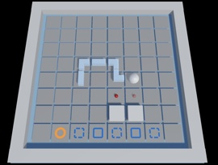

Snake Puzzles
---

Puzzle game inspired by Snake and The Witness. Download from the [Releases](https://github.com/logchan/SnakePuzzles/releases) page.

There is a [Level Editor](https://github.com/logchan/snake-puzzles-editor) for creating your own levels.

## Highlights

- Control a snake and solve puzzles
- 30 levels + 8 special levels
- Make your own puzzles
    - Three example levels are provided in the [CustomLevelExamples](CustomLevelExamples) folder
    - Put level json files in `C:\Users\%USERNAME%\AppData\LocalLow\cc_logu\SnakePuzzles\Custom`
    - These levels are from early testing of the game, and were removed because of their difficuties.

## Future Development

This game will be updated as I come up with more ideas (and time) of puzzles and mechanics.

It is also used as my testbed for Unity stuff.

## License

MIT License.

## Credits

Special thanks to my friends for test playing.

See [sounds.txt](sounds.txt) for a list of used sound from the Internet.
